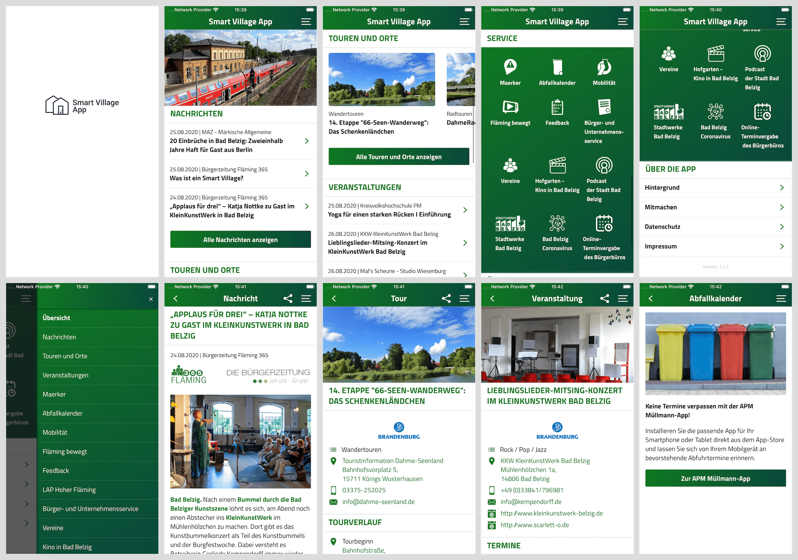
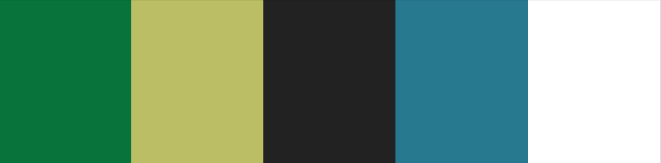

# Smart Village App - Mobile App

   

The Smart Village App is a open source mobile app for villages, communities and counties. It is made with React Native for Android and iOS.

Please visit the german website to get in touch with us and present your ideas and visions: https://smart-village.app.

&nbsp;

This mobile app is one main part of the whole Smart Village App project. For more information visit https://github.com/smart-village-solutions/smart-village-app-app.

## Overview

The following screens are examples of an existing app variation.

## Colors

Your mobile app should consist of five main different colors, for example:

https://coolors.co/08743c-bbbe64-222222-26798e-ffffff

## Documentation

For detailed documentation see the [docs](./docs/INDEX.md).

## Changelog

Have a look at the [changelog](./CHANGELOG.md) to be up to date with the development process.

---

###### Version: 4.2.0
