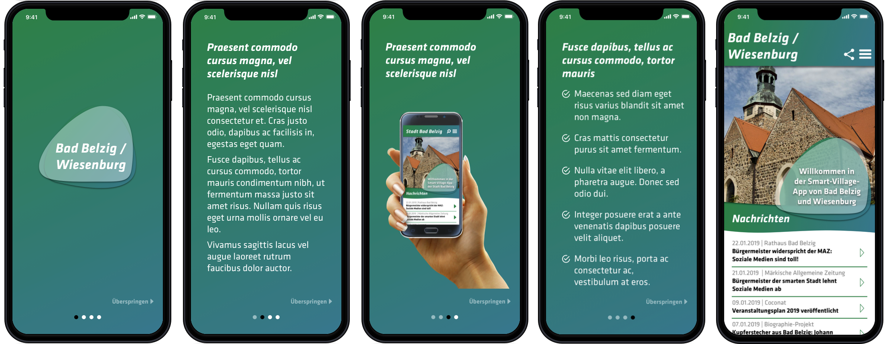

# Smart Village App - Mobile App 

   

The Smart Village App will be a mobile app made with React Native.

&nbsp;

This mobile app is one main part of the whole Smart Village App project. For more information visit https://github.com/ikuseiGmbH/smart-village-app.

## Overview

The following screens are showing a prototyped layout for an intro slider and the home screen.

## Colors

Currently used colors in the mobile app:

https://coolors.co/08743c-bbbe64-222222-26798e-ffffff

## Tech Stack

Information about currently used packages and their versions:

* React Native (0.57.1): https://github.com/facebook/react-native
* React (16.8.6): https://github.com/facebook/react
* React Navigation (3.9.1): https://github.com/react-navigation/react-navigation
* Jest (24.8.0): https://github.com/facebook/jest
