# Augmented Reality Documentation

The information required to use the Augmented Reality feature will be specified here

## Package used and system requirements

- [Viro](https://viro-community.readme.io)
- [iOS Requirements](https://developer.apple.com/library/archive/documentation/DeviceInformation/Reference/iOSDeviceCompatibility/DeviceCompatibilityMatrix/DeviceCompatibilityMatrix.html)
- [Android Requirements](https://developers.google.com/ar/devices)

## What to do on the server side

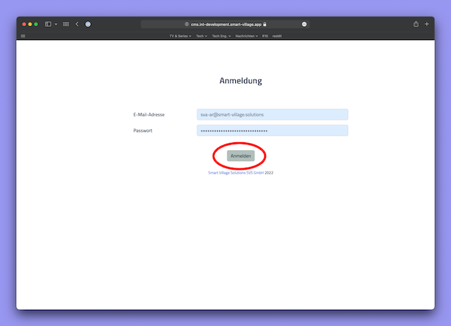

- Go to the CMS page and log in

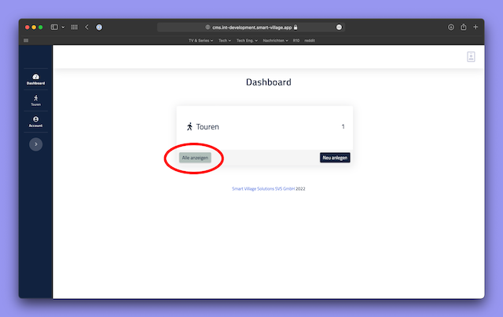

- Go to the list of tours

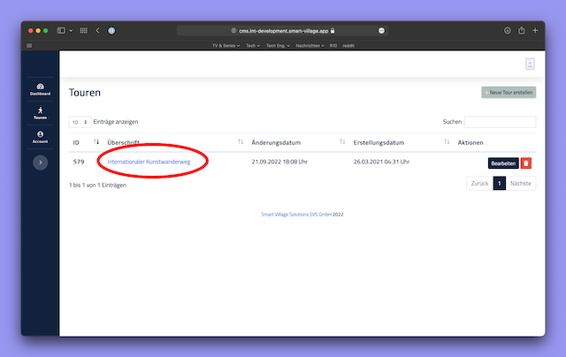

- Select the tour you want to add Augmented Reality feature to

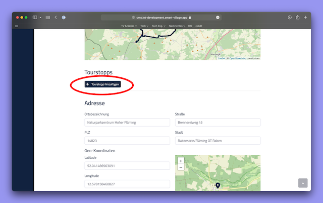

- Add new Tourstopps on the tour detail page
- Edit the sections added for Augmented Reality in Tourstopps

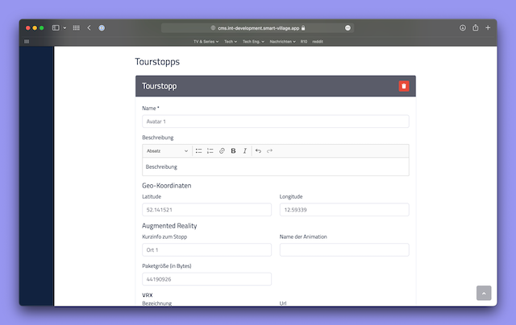
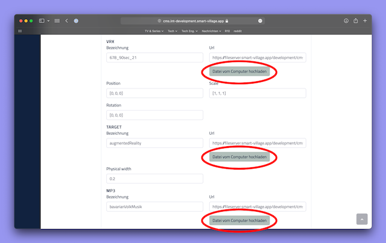
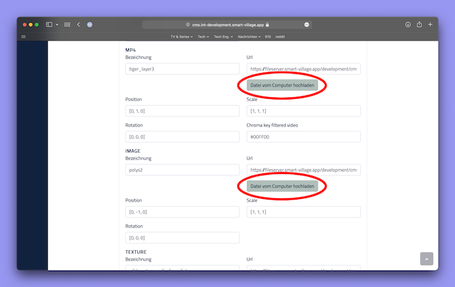
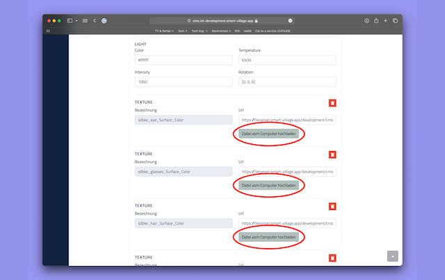

- To find out what types of files you can upload, see the [next section](#materials-that-can-be-added-to-a-scene)
- After entering all the information, press the save button

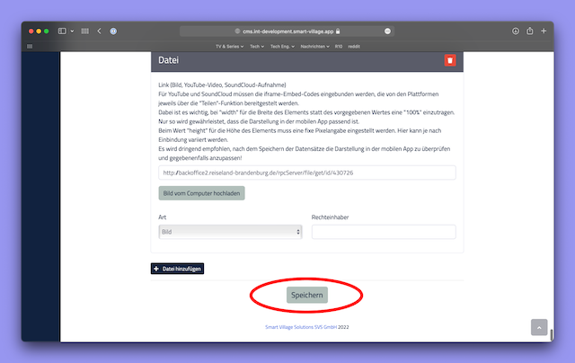

**How to upload 3D Model (video)**

[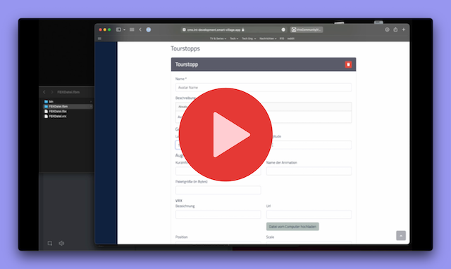](https://www.youtube.com/watch?v=0i_jmbDfhes)

## Materials that can be added to a scene

- **VRX:** To upload a 3D model, you must make sure that the model is in VRX format. [VRX Converter](#converter-required-when-uploading-a-3d-model-mac-osx--linux-support-only) (Required) [Viro3DObject](https://viro-community.readme.io/docs/viro3dobject)
- **TARGET:** If you want your 3D model to have an image recognition function, upload the desired image in this section (Optional) [ViroARImageMarker](https://viro-community.readme.io/docs/viroarimagemarker)
- **MP3:** If you want a sound file in Augmented Reality scene, upload it to this section (Optional) [ViroSound](https://viro-community.readme.io/docs/virosound)
- **MP4:** If you want a video on Augmented Reality scene, please upload it to this section (Optional) [ViroVideo](https://viro-community.readme.io/docs/virovideo)
- **IMAGE:** If you want a picture in the Augmented Reality scene, upload it to this section (Optional) [ViroImage](https://viro-community.readme.io/docs/viroimage)
- **TEXTURE:** The section where you can upload the multiple texture files required for the 3D model (Required)
  - **Important!** Each texture file has a specific name. Please enter this specific name in the name field. Otherwise there will be a problem in displaying the 3D model.

File naming examples:

**texture :**
|filename|file type|upload name|
|--|--|--|
|1simple|texture|1simple|
|2simple|texture|2simple|

**other files :**
|filename|file type|cms name|
|--|--|--|
|image|target|augmentedRealityTargetImage|
|bild12|png|test-bild|
|video3|mp4|test-vid|
|sound|mp3|music|
|3dobject|vrx|test-123123|

## Customisation of the Augmented Reality scene

**Note!** To view the customisation in Augmented Reality scene, you need to delete the 3D model you downloaded in the application and download it again!

- **Name:** Write the name you want your 3D model to be displayed in this section (Required) (String)
- **Description:** Write the description you want your 3D model to be displayed in this section (Optional) (String)
- **Geo-Koordinaten:**
  - **Latitude & Longitude:** Write the coordinates of your 3D model that you want to be displayed on the map in this section (Optional) (Float)
- **Animation name:** The field where the name of the animation of the 3D model can be written (Optional) (String)
- **Package size:** This is the field where the total size of all Augmented Reality scene objects you have loaded should be written in bytes. The value added to this section allows the user to show how many MB files will be downloaded in the application. (Required) (Number)
- **VRX & MP4 & IMAGE:**
  - Set the Position, Size and Rotation properties according to x,y,z coordinates. (Array[Float]) [Scenes](https://viro-community.readme.io/docs/scenes)
- **TARGET:**
  - _Physical width_ - Allows you to set the distance in the physical world (in metres) between the image and the device's camera. (Number)
- **MP3:**
  - _Is spatial sound_ - A field that allows you to specify whether the audio file you are uploading has spatial audio capability. takes true or false value [ViroSpatialSound](https://viro-community.readme.io/docs/virospatialsound#onfinish)
  - If Spatial Audio is true:
    - _Max distance:_ A distance after which the audio can not be heard. (Number)
    - _Min distance:_ A distance after which the audio will begin to attenuate until maxDistance where the sound is completely gone. (Number)
    - _Rolloff model:_ The rolloff model which determines how the sound volume will fall off between minDistance and maxDistance. Can take `None`, `Linear` & `Logarithmic` values as String
- **MP4:**
  - _Chroma key filtered video_ - If the video you want to add to the Augmented Reality scene has a background colour that you want to delete, add the colour code in HEX format here. Example: #00FF00 (String)

## Display of added tourstopps in the app

To download the 3D model from the tour detail screen:

1. Press the hamburger menu button in the top right corner of the app and select "Tours and Places" from the drop-down menu,
2. Scroll to the bottom of the page and in the "select the section where you have added.." category select the section where you have added tourstopps,
3. Select the tour you added tourstopps to from the displayed tour list and scroll to the bottom of the tour details page,
4. Select the downloaded file from the artworks list and click on the "Downloaden & AR Kunst gucken" button and wait for the 3D object to download,
5. When finished, click the button to view the 3D model on the screen that is navigated to.

To download the 3D model from the settings screen:

- **Note:** In order to avoid an error on the settings page, please open an object called `ar` in the `settings` object in `globalSettings` and write the id of the tour you added tourstopp with the key `tourId`.

1. Go to the settings page of the application.
2. Select `AR Settings`.
3. Download the "Sample File" to your device.

To delete the 3D model from the device:

1. Open the detail page of the relevant tour.
2. Scroll down the detail page.
3. Click on the "Kunstwerke laden" button and wait for the modal to open.
4. In the opened modal, an "x" will be displayed next to the items you have downloaded to your device
5. Click on the downloaded item. Select "Delete" on the warning screen.
6. If you see the download button again, the 3D object has been deleted from your device.

Delete the 3D model from the settings screen:

1. Go to the settings page of the app.
2. Select "AR settings".
3. In the list you will see an "x" next to the items you have downloaded to your device.
4. Click on the downloaded item. Select "Delete" on the warning screen.
5. When you see the download button again, the 3D object has been deleted from your device.

## Converter required when uploading a 3D Model (Mac OSX & Linux Support Only)

- [**Download FBX to VRX converter**](https://fileserver.smart-village.app/development/augmented-reality/VRX_Converter/bin/ViroFBX)
- [Viro Community Documentation](https://viro-community.readme.io/docs/3d-objects#fbx)
- [ViroFBX Github Documentation (MacOS)](https://github.com/ViroCommunity/ViroFBX)
- [ViroFBX Github Documentation (Linux)](https://github.com/ViroCommunity/ViroFBX/tree/linux-support)

**How to use Converter (images)**

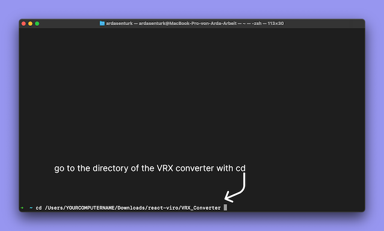
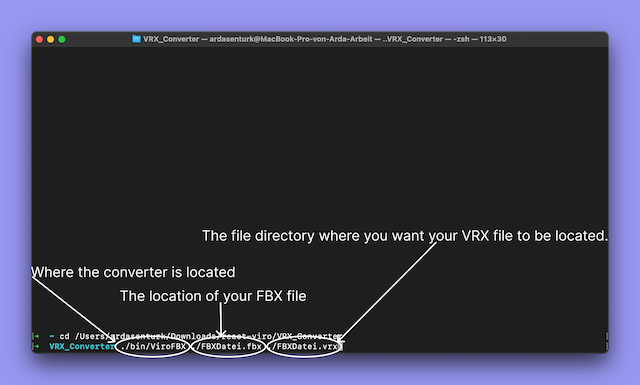
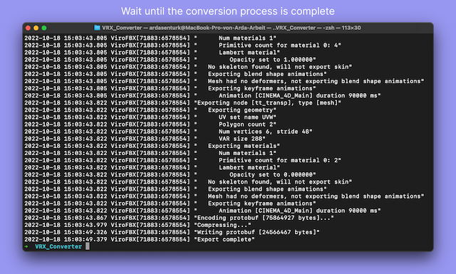
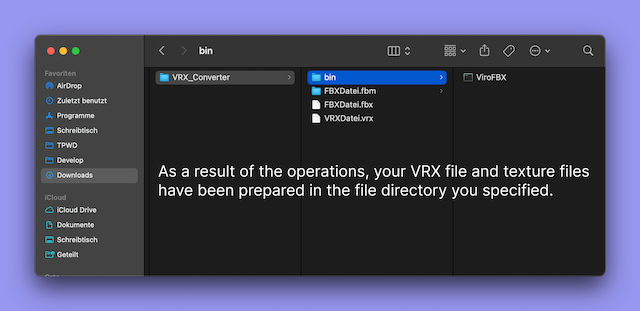

**How to use Converter (video)**

[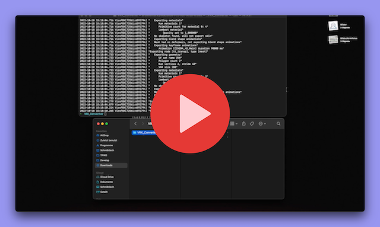](https://www.youtube.com/watch?v=VANrglRc5v4)
